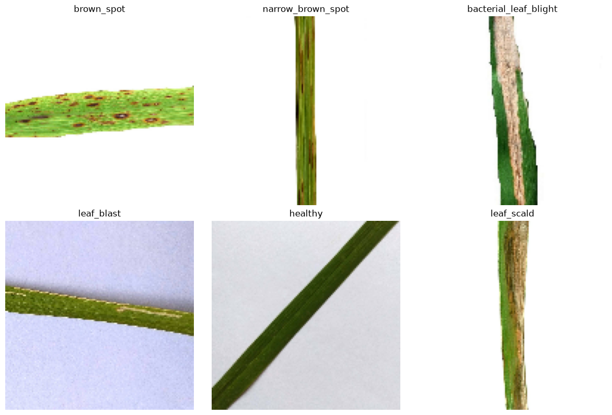
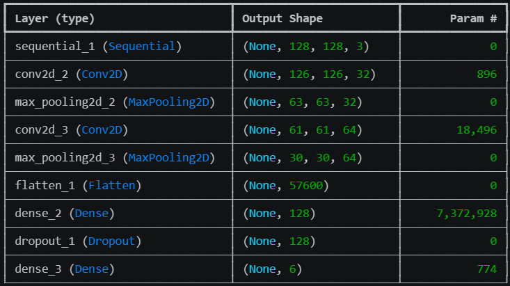
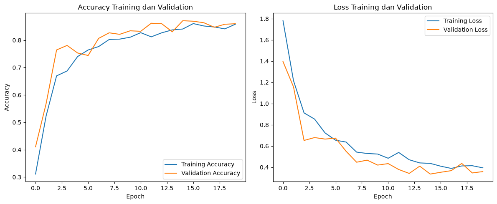
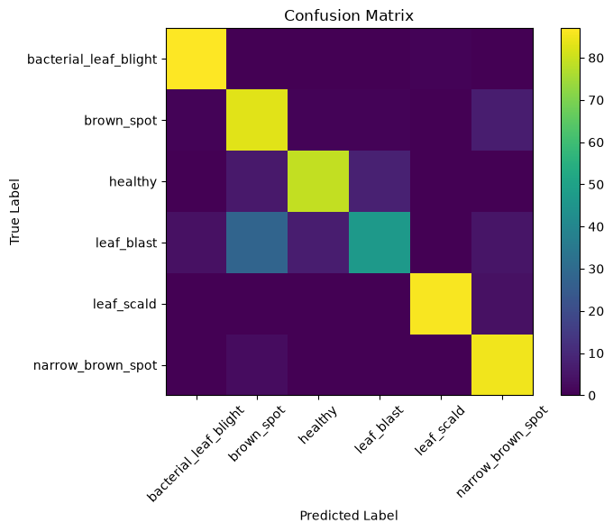
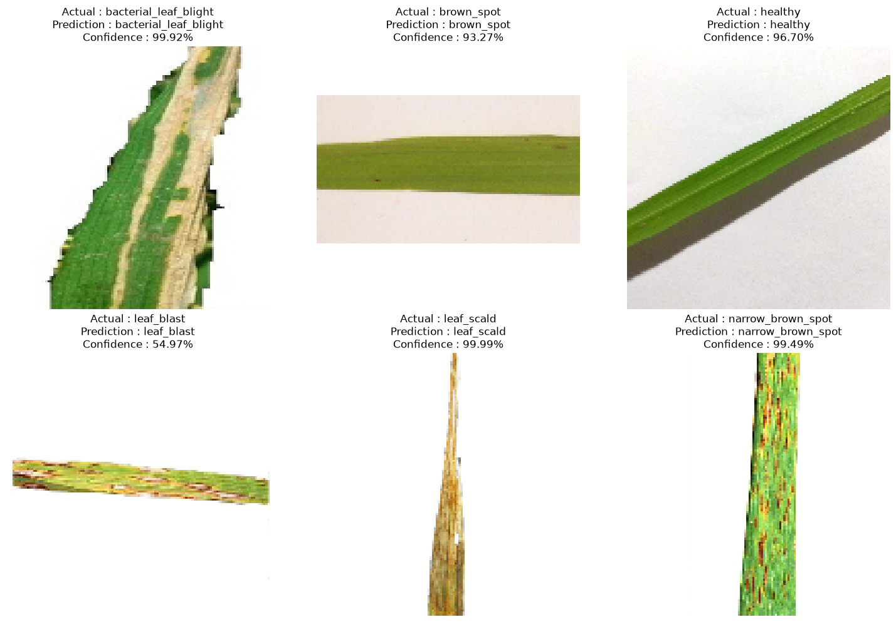

# Classification of Rice Leaf Diseases Using Convolutional Neural Network (CNN)


## Overview

This project implements a **Convolutional Neural Network (CNN)** model using **TensorFlow/Keras** to classify rice leaf images into six different disease classes.

The main objective of this project is to develop a deep learning model capable of identifying rice leaf conditions based on visual image characteristics.

The model performs image classification to distinguish healthy rice leaves and several common rice diseases.

---

# Dataset

## Dataset Information

Dataset used:

**RiceLeafsv3**

The dataset contains six rice leaf classes:

- bacterial_leaf_blight
- brown_spot
- healthy
- leaf_blast
- leaf_scald
- narrow_brown_spot


## Dataset Distribution

Training data:

- 2,167 images

Validation data:

- 543 images


Due to the large dataset size, the original image dataset is not included in this repository.

---

# Dataset Preprocessing

The image preprocessing steps include:

- Resize image into **128 × 128 pixels**
- RGB normalization
- Data augmentation

Example visualization of dataset classes:




---

# CNN Model Architecture

The CNN model was developed using TensorFlow/Keras with the following layers:

- Conv2D
- MaxPooling2D
- Flatten
- Dense
- Dropout


The model receives RGB images with size **128 × 128 × 3** and performs classification into six output classes.

Model architecture summary:




---

# Training Configuration

The model was trained using the following configuration:

| Parameter | Value |
|---|---|
| Optimizer | Adam |
| Loss Function | Sparse Categorical Crossentropy |
| Batch Size | 32 |
| Epoch | 20 |
| Input Image Size | 128 × 128 pixels |


---

# Model Performance

The model evaluation results:

| Metric | Result |
|---|---|
| Training Accuracy | 85.83% |
| Validation Accuracy | 86.00% |
| Average F1-score | 0.85 |


---

# Training Performance

The training process was monitored using accuracy and loss curves.




---

# Model Evaluation

The model was evaluated using:

- Accuracy curve
- Loss curve
- Confusion Matrix
- Classification Report


Confusion matrix visualization:




The evaluation shows that the CNN model can classify most rice leaf images correctly according to their respective classes.

---

# Prediction Result

The trained CNN model was tested using new rice leaf images.

The prediction output provides:

- Predicted class
- Confidence score


Example prediction results:




---

# Project Structure

Mini_Project_CNN_RiceLeaf/

│
├── Mini_Project_CNN_RiceLeaf.ipynb

├── cnn_model_summary.png

├── confusion_matrix.png

├── prediction_result.png

├── riceleafsv3_classes.png

├── training_history.png

└── README.md

---

# Technologies Used

This project was developed using:

- Python
- TensorFlow
- Keras
- Jupyter Notebook
- Convolutional Neural Network (CNN)


---

# How to Run the Project

Clone this repository:

```bash
git clone https://github.com/dedylesmana/Mini_Project_CNN_RiceLeaf.git

pip install tensorflow numpy matplotlib seaborn scikit-learn

```

Run the notebook:

```bash
Mini_Project_CNN_RiceLeaf.ipynb
```

Run all cells to reproduce:

- Dataset preprocessing
- CNN model training
- Model evaluation
- Rice leaf prediction


---

# Conclusion

This project demonstrates the implementation of a Convolutional Neural Network (CNN) for rice leaf disease classification.

The model successfully classified six rice leaf classes with validation accuracy of approximately **86%**.

The result shows that deep learning methods can be applied to support rice leaf disease identification based on image characteristics.


---

# Author

**M. Dedy Lesmana**

**Project:** Rice Leaf Disease Classification Using Convolutional Neural Network (CNN)

**Framework:** TensorFlow & Keras

**Method:** Deep Learning - Convolutional Neural Network (CNN)
